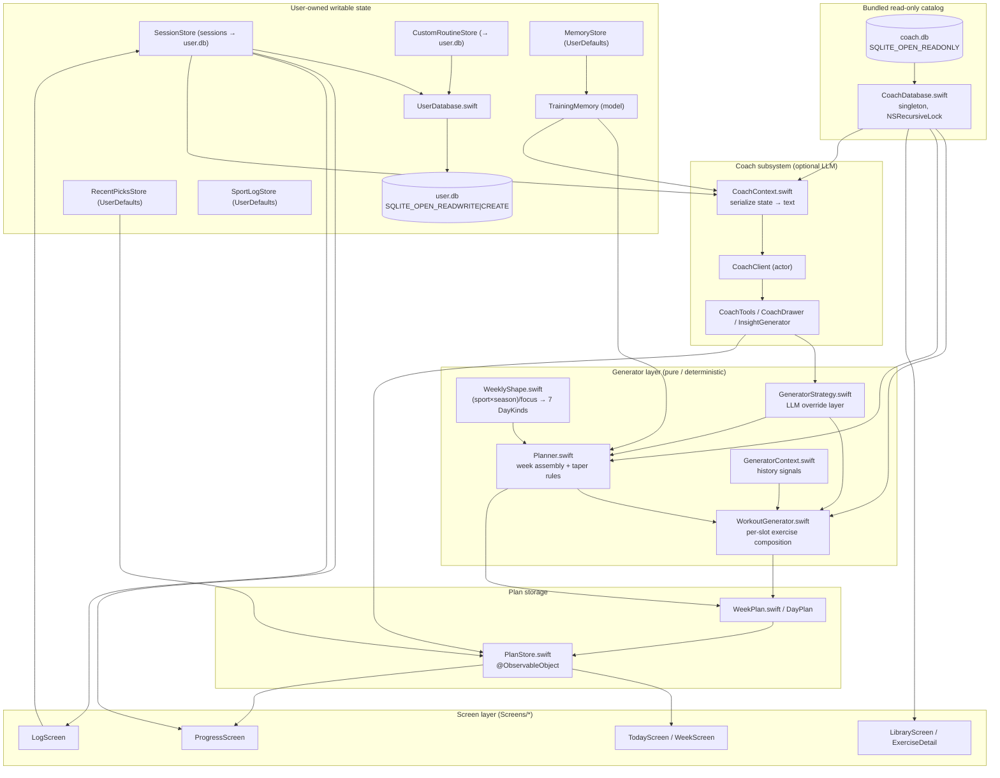

# Phase Training 2 — Architecture Map
_Reference document · 2026-05-26 · read-only review_

A periodization training app. A bundled read-only catalog (`coach.db`) feeds a
deterministic rules-based generator, which produces a weekly plan that the
screen layer renders. All user-authored state writes to a separate writable
store (`user.db` + `UserDefaults`). An optional LLM "Coach" subsystem reads a
serialized text snapshot of app state and can return strategy overrides.

## 1. System diagram

## 2. Load-bearing files

| File | Lines | Responsibility | Why load-bearing |
|------|-------|----------------|------------------|
| `Data/WorkoutGenerator.swift` | 1124 | Composes a lift day slot-by-slot from coach.db, shaped by profile + focus | Sole source of generated workouts; deterministic; owns accessory + prescription + RPE logic |
| `Data/CoachDatabase.swift` | 1014 | Read-only SQLite gateway to the bundled catalog | Every catalog read (exercises, muscles, patterns, equipment, injuries, substitutes) funnels here |
| `Data/Planner.swift` | 864 | Pure week assembler: shape → slots → taper/recovery rules | Turns long-term memory + overrides into a 7-day `WeekPlan`; calls WorkoutGenerator per lift slot |
| `Coach/CoachContext.swift` | 826 | Serializes live app state into compact text for the LLM | Single boundary between app state and the model; defines what the coach can "see" |
| `Data/UserDatabase.swift` | 719 | Read-write SQLite store at `Documents/user.db` | Owns all durable user writes (sessions, custom routines); isolates user data from catalog stomps |
| `Data/TrainingMemory.swift` | 680 | Long-term user truth model + enums (PrimaryFocus, SeasonPhase, Sport) | The canonical input to planning; `planInputsHash` drives drift detection |
| `Data/PlanStore.swift` | 648 | `@ObservableObject` owning the current WeekPlan + overrides | Bridges generator output to SwiftUI; persists plan/overrides in UserDefaults; triggers regen |
| `Screens/LogScreen.swift` | 1237 | Active-session logging UI (sets/reps/weight/RPE) | Primary write surface into SessionStore/user.db |
| `Screens/ProgressScreen.swift` | 927 | Volume / muscle-balance / PR analytics | Largest read consumer of session history + coach.db muscle data |
| `Screens/TodayScreen.swift` | 916 | Today's prescribed day + start-workout entry | Main daily entry point reading PlanStore |
| `Data/SessionStore.swift` | 445 | Active session (UserDefaults hot path) + saved sessions (user.db) | Owns the workout-history write path; feeds GeneratorContext + Progress |
| `Data/WeekPlan.swift` | 362 | `WeekPlan` / `DayPlan` / `GeneratedWorkout` value types | Shared contract between generator, store, and screens |
| `Data/DemographicProfile.swift` | 256 | Derives lift days, session minutes, `preferredDifficulties` from memory | Translates experience/age into the constraints the generator queries with |
| `Data/GeneratorContext.swift` | 278 | History-derived signals (sore areas, pattern freq, prior bests, stagnation) | Lets the generator personalize without coupling to stores |
| `Data/WeeklyShape.swift` | 180 | Lookup tables: (sport×season) / focus → 7 `DayKind`s | The actual periodization mechanism (see §4) |
| `Data/GeneratorStrategy.swift` | 91 | LLM override layer (focus, emphasis, intensity, per-exercise overrides) | Injection point letting the Coach reshape generation |

## 3. Deep-dive — hypertrophy accessory-layer logic

Entry point is the core `generate(...)` loop (`WorkoutGenerator.swift:70`),
which after building the primary slot picks classifies the focus
(`isUpperPush` `:209`, `isLowerBody` `:215`) and, only when
`memory.primaryFocus == .hypertrophy`, calls one of two appenders
(`:216`, `:231`).

- `appendHypertrophyUpperPushAccessories` (`:589`) injects side-delt + tricep
  isolation. It first computes `existingMuscles` from **isolation-only** picks
  (`primeMusclesOfPicks(existingPicks.filter { !$0.isCompound })`, `:603`), then
  adds a Cable Lateral Raise unless `existingMuscles` already contains
  `delt-lateral`/`delt-posterior` (`:608`), and a Rope Pushdown unless it
  contains `triceps` (`:618`).
- `appendHypertrophyLowerBodyAccessories` (`:637`) adds Lying Leg Curl unless
  `existingMuscles.contains("hamstrings")` (`:650`) and Standing Calf Raise
  gated on `existingMuscles.isDisjoint(with: ["calves","gastrocnemius","soleus"])`
  (`:664`). The disjoint check (not `.contains("calves")`) is deliberate:
  coach.db tags the calf primaries as the components `gastrocnemius`/`soleus`,
  so a plain group-slug check would miss an existing calf slot and double-append
  (comment `:659-663`).
- `existingMuscles` is resolved via `primeMusclesOfPicks` (`:678`), which calls
  `CoachDatabase.shared.musclesForExercise` and keeps only `role == "primary"`
  slugs.
- Picks are materialized by `pickAccessoryByName` (`:693`) — first canonical
  name that survives env + equipment + exclusion filters — then turned into a
  row by `makeAccessoryRow` (`:723`), which reuses `prescription` and
  `rpeTempoHints` so accessories get the accessory scheme.

**Difficulty bucketing inside `pickForSlot` (`:272`):** for each candidate
pattern, a staples-across-all-allowed-difficulties pre-pass queries with
`Set(profile.preferredDifficulties)` and keeps only staples (`:354-368`). If no
staple hits, it falls into the **per-bucket loop** (`for bucket in
profile.preferredDifficulties`, `:373`) querying one difficulty at a time, then
a difficulty-relaxed pass (`:391`). The staples pre-pass exists specifically so
a canonical lift in a *lower* difficulty bucket beats a sport-flavored variant
in the user's preferred bucket while still never handing a beginner an advanced
staple (comment `:347-353`). Final selection within a pool is
`deterministicPick` (djb2 fold of hashSeed+slotIdx, `:792`).

## 4. Deep-dive — periodization phase selection

Periodization is driven by **`SeasonPhase`**, not by any per-exercise phase
table. Flow:

1. The user's season resolves via `TrainingMemory.seasonForPlanner`
   (`TrainingMemory.swift:238`) — `seasonsBySport[primarySport]` else
   `defaultSeason`. `SeasonPhase` cases: off/pre/in-season, eventPrep,
   maintenance (`TrainingMemory.swift:360`).
2. `Planner.generateUnbiased` calls `WeeklyShape.resolve(primarySport:season:focus:)`
   (`Planner.swift:138`).
3. `WeeklyShape.resolve` (`WeeklyShape.swift:21`) falls through:
   `(sport,season)` → `(sport,.maintenance)` → `(focus)` → `defaultShape`,
   returning a 7-element `[DayKind]` priority sequence (tables at
   `WeeklyShape.swift:54` and `:161`).
4. The Planner walks that shape to fill slots, then applies phase-aware taper
   passes: `applyPreEventTaper` (`:437`), `applyPostEventRecovery` (`:470`),
   `applyPreSportBuffer` (`:491`), and `applyPeakDateTaper` (`:522`, fires only
   when `seasonForPlanner == .eventPrep` and a `peakDate` lands in-week).
5. For each `.lift` slot the Planner calls `WorkoutGenerator.generateLift`
   (`Planner.swift:378`). The **WorkoutFocus** there is derived from
   `(liftIndex, totalLifts)` (`WorkoutFocus.lift`, `WorkoutGenerator.swift:1001`),
   NOT from the season. Exercise *intensity* phasing comes from
   `memory.primaryFocus` via `focusBias` (`WorkoutGenerator.swift:899`).

**`exercise_phases` is dead at runtime.** The table exists in the source schema
(`db/source/_schema.sql:67`) and the DB build/prune scripts
(`scripts/db/build_db.py:43`, `extract_to_source.py:40`,
`dedupe_exercises.py:55`), but **no Swift file queries it** — `grep exercise_phases`
returns only schema/script hits. Likewise `routines.phase` is SELECTed
(`CoachDatabase.swift:86`) and decoded into `BundledRoutineRow.phase`
(`BundledRoutineRow.swift:10`) but is never read by any selection or UI logic.
So mesocycle-style phasing lives entirely in `SeasonPhase`→`WeeklyShape`;
the catalog's phase tagging is currently unused capacity.

## 5. Specific answers

### (a) Where does difficulty bucketing happen?

Three layers, all keyed on `DemographicProfile.preferredDifficulties` (the
ordered allow-list derived from experience/age in
`DemographicProfile.swift:154-161`, e.g. intermediate → `["intermediate","beginner"]`):

- **Generated workouts:** `WorkoutGenerator.pickForSlot` — staples pre-pass with
  the full set (`WorkoutGenerator.swift:354-368`) then the per-bucket loop
  `for bucket in profile.preferredDifficulties` (`WorkoutGenerator.swift:373`).
- **Bundled-routine selection:** `Planner.pickRoutine`
  `for bucket in profile.preferredDifficulties` (`Planner.swift:750`), matched
  by `difficultyMatches` (`Planner.swift:823`).
- **SQL boundary enforcement:** the actual difficulty filter is applied in
  `CoachDatabase.exercises(matchingPattern:...)` at
  `CoachDatabase.swift:588-589` (`difficulties.contains(d)`), plus the optional
  `e.difficulty = ?` clause in `listExercises` (`CoachDatabase.swift:256-259`).

### (b) User DB vs bundled catalog write boundary

**`coach.db` is read-only at runtime — confirmed.** Opened with
`SQLITE_OPEN_READONLY | SQLITE_OPEN_FULLMUTEX` (`CoachDatabase.swift:40`).
`CoachDatabase` exposes only `SELECT` methods; no INSERT/UPDATE/DELETE/CREATE
text appears in the file. It is loaded from the app bundle
(`Bundle.main.path(forResource: "coach", ofType: "db")`, `:39`).

**All writes are owned by `user.db` (via `UserDatabase`) and `UserDefaults`
stores.** `UserDatabase` opens `Documents/user.db` with
`SQLITE_OPEN_READWRITE | SQLITE_OPEN_CREATE | SQLITE_OPEN_FULLMUTEX`
(`UserDatabase.swift:50`). Write paths found:

| Write path | File:line | Backing |
|------------|-----------|---------|
| Schema creation / migrations (`CREATE TABLE/INDEX`) | `UserDatabase.swift:64-146` | user.db |
| `saveRoutine` (INSERT/UPDATE user_routines + replace exercises) | `UserDatabase.swift:246-291` | user.db |
| `deleteRoutine` / `clearAllRoutines` (DELETE) | `UserDatabase.swift:291-307` | user.db |
| `saveSession` (DELETE+INSERT sessions/exercises/sets) | `UserDatabase.swift:516-553` | user.db |
| `deleteSession` / `clearAllSessions` (DELETE) | `UserDatabase.swift:597-608` | user.db |
| SessionStore → `userDB.saveSession` / `clearAllSessions` | `SessionStore.swift:65,111-113` | user.db (via UserDatabase) |
| CustomRoutineStore → UserDatabase + legacy import | `CustomRoutineStore.swift:33,50-54` | user.db (via UserDatabase) |
| Active session hot autosave | `SessionStore.swift:91` | UserDefaults `pt_active_session` |
| TrainingMemory persistence | `MemoryStore.swift:31` | UserDefaults `pt_training_memory` |
| WeekPlan + overrides persistence | `PlanStore.swift:621,631` (keys `pt_week_plan`, `pt_week_overrides`) | UserDefaults |
| Recent exercise picks | `RecentPicksStore.swift:75` | UserDefaults `pt_recent_exercise_picks` |
| Sport logs | `SportLog.swift:91,103` | UserDefaults `pt_sport_logs` |
| Coach consent flag | `PlanStore+LLMRefinement.swift:48` (`CoachConsent.storageKey`) | UserDefaults |

No write path targets the bundled catalog. The two-DB split is intentional
(`UserDatabase.swift:4-16`): the catalog can be replaced on every install
without touching user data, and there are no cross-DB ATTACH joins — name
lookups go back through `CoachDatabase.exercise(id:)`.
