# coach.db Catalog Audit

**Date:** 2026-05-26  
**DB path:** `db/coach.db` (also bundled at `PhaseTraining/Resources/coach.db`)  
**Total exercises:** 551 across 20 tables

---

## ERD

### Table inventory with row counts

| Table | Rows | PK | Notes |
|---|---|---|---|
| exercises | 551 | id | Core entity |
| sport_categories | 216 | id | Self-ref parent_id; depth 0=umbrella 1+=leaf |
| muscle_groups | 80 | id | Self-ref parent_id |
| equipment | 77 | id | |
| routines | 148 | id | |
| common_injuries | 56 | id | |
| movement_patterns | 40 | id | |
| exercise_muscles | 1,455 | (exercise_id, muscle_group_id) | FK → exercises, muscle_groups |
| exercise_sport_relevance | 2,303 | (exercise_id, sport_id) | FK → exercises, sport_categories |
| exercise_phases | 1,133 | (exercise_id, phase) | FK → exercises |
| routine_exercises | 1,003 | id | FK → routines, exercises |
| exercise_substitutions | 989 | (exercise_id, substitute_id) | FK → exercises×2 |
| exercise_equipment | 752 | (exercise_id, equipment_id) | FK → exercises, equipment |
| routine_sports | 623 | (routine_id, sport_id) | FK → routines, sport_categories |
| exercise_movement_patterns | 593 | (exercise_id, movement_pattern_id) | FK → exercises, movement_patterns |
| sport_recovery_profiles | 177 | sport_id | FK → sport_categories |
| exercise_injury_relevance | 224 | (exercise_id, injury_id) | FK → exercises, common_injuries |
| injury_sport_prevalence | 218 | (injury_id, sport_id) | FK → common_injuries, sport_categories |
| explanation_templates | 49 | id | FK → `adjustment_trigger_types` (table **does not exist**) |
| exercise_aliases | 0 | id | FK → exercises; empty |

### Mermaid ERD

```mermaid
erDiagram
    exercises {
        INTEGER id PK
        TEXT name
        TEXT slug
        TEXT description
        TEXT instructions
        TEXT difficulty
        TEXT modality
        TEXT swap_group
        INTEGER recovery_demand
        INTEGER cns_load
        TEXT image_url
        TEXT video_url
        TEXT thumbnail_url
    }
    muscle_groups {
        INTEGER id PK
        TEXT name
        TEXT slug
        INTEGER parent_id FK
    }
    equipment {
        INTEGER id PK
        TEXT name
        TEXT slug
        TEXT category
    }
    movement_patterns {
        INTEGER id PK
        TEXT name
        TEXT slug
    }
    sport_categories {
        INTEGER id PK
        TEXT name
        TEXT slug
        INTEGER parent_id FK
        INTEGER depth
    }
    common_injuries {
        INTEGER id PK
        TEXT name
        TEXT slug
        TEXT body_region
    }
    routines {
        INTEGER id PK
        TEXT name
        TEXT phase
        TEXT goal
    }
    exercise_muscles {
        INTEGER exercise_id FK
        INTEGER muscle_group_id FK
        TEXT role
    }
    exercise_equipment {
        INTEGER exercise_id FK
        INTEGER equipment_id FK
        INTEGER is_required
    }
    exercise_movement_patterns {
        INTEGER exercise_id FK
        INTEGER movement_pattern_id FK
    }
    exercise_sport_relevance {
        INTEGER exercise_id FK
        INTEGER sport_id FK
        REAL relevance_score
        TEXT support_role
        TEXT specificity
        TEXT season_emphasis
    }
    exercise_phases {
        INTEGER exercise_id FK
        TEXT phase
        TEXT priority
        TEXT volume_guidance
    }
    exercise_substitutions {
        INTEGER exercise_id FK
        INTEGER substitute_id FK
        TEXT context
        REAL similarity_score
    }
    exercise_injury_relevance {
        INTEGER exercise_id FK
        INTEGER injury_id FK
        TEXT role
    }
    exercise_aliases {
        INTEGER id PK
        INTEGER exercise_id FK
        TEXT alias
    }
    routine_exercises {
        INTEGER id PK
        INTEGER routine_id FK
        INTEGER exercise_id FK
        INTEGER position
    }
    routine_sports {
        INTEGER routine_id FK
        INTEGER sport_id FK
    }
    sport_recovery_profiles {
        INTEGER sport_id FK
        INTEGER typical_recovery_hours
        TEXT primary_fatigue_type
    }
    injury_sport_prevalence {
        INTEGER injury_id FK
        INTEGER sport_id FK
        TEXT prevalence
    }
    explanation_templates {
        INTEGER id PK
        INTEGER trigger_type_id
        TEXT adjustment_type
        TEXT template
        TEXT tone
    }

    exercises ||--o{ exercise_muscles : "tagged"
    muscle_groups ||--o{ exercise_muscles : "tagged to"
    muscle_groups ||--o| muscle_groups : "parent"
    exercises ||--o{ exercise_equipment : "requires"
    equipment ||--o{ exercise_equipment : "used by"
    exercises ||--o{ exercise_movement_patterns : "categorised"
    movement_patterns ||--o{ exercise_movement_patterns : "categorises"
    exercises ||--o{ exercise_sport_relevance : "relevant to"
    sport_categories ||--o{ exercise_sport_relevance : "covers"
    sport_categories ||--o| sport_categories : "parent"
    exercises ||--o{ exercise_phases : "assigned"
    exercises ||--o{ exercise_substitutions : "has sub"
    exercises ||--o{ exercise_injury_relevance : "injury role"
    common_injuries ||--o{ exercise_injury_relevance : "linked"
    exercises ||--o{ exercise_aliases : "alias"
    routines ||--o{ routine_exercises : "contains"
    exercises ||--o{ routine_exercises : "in"
    routines ||--o{ routine_sports : "tagged"
    sport_categories ||--o{ routine_sports : "tags"
    sport_categories ||--o{ sport_recovery_profiles : "profiled"
    common_injuries ||--o{ injury_sport_prevalence : "prevalent in"
    sport_categories ||--o{ injury_sport_prevalence : "has injuries"
```

---

## Population & usage matrix

> "% ex covered" = % of 551 exercises with ≥1 row in that table.  
> "Queried in Swift" = table appears in an actual `FROM`/`JOIN` clause (not just a comment or string literal).

| Table | Rows | Distinct ex covered | % ex covered | Queried in Swift (file) | Verdict |
|---|---|---|---|---|---|
| exercise_muscles | 1,455 | 551 | **100%** | `CoachDatabase.swift`, `MuscleVolume.swift` | **Used** |
| exercise_equipment | 752 | 551 | **100%** | `CoachDatabase.swift`, `Planner.swift` | **Used** |
| exercise_sport_relevance | 2,303 | 475 | **86%** | `CoachDatabase.swift` (5 query sites) | **Used** |
| exercise_movement_patterns | 593 | 475 | **86%** | `CoachDatabase.swift` (4 query sites) | **Used** |
| exercise_substitutions | 989 | 304 | **55%** | `CoachDatabase.swift`, `GeneratorContext.swift`, `Exercise.swift` | **Used** |
| exercise_injury_relevance | 224 | 167 | **30%** | `CoachDatabase.swift` (3 query sites), `CommonInjury.swift` | **Used** |
| exercise_phases | 1,133 | 326 | **59%** | **None** — zero `FROM`/`JOIN` anywhere in Swift | **Populated-but-unused** |
| routine_sports | 623 | — (148/148 routines) | 100% of routines | **None** — zero `FROM`/`JOIN` anywhere in Swift | **Populated-but-unused** |
| sport_recovery_profiles | 177 | — (177/193 leaf sports) | 92% of leaf sports | **None** — zero `FROM`/`JOIN` anywhere | **Populated-but-unused** |
| injury_sport_prevalence | 218 | — (56/56 injuries) | 100% of injuries | **None** | **Populated-but-unused** |
| explanation_templates | 49 | — (not exercise-keyed) | n/a | **None** | **Populated-but-unused** |
| exercise_aliases | 0 | 0 | **0%** | **None** | **Vestigial** |
| routines | 148 | — | — | `CoachDatabase.swift`, 14+ files | **Used** |
| routine_exercises | 1,003 | — | — | `CoachDatabase.swift`, `BundledRoutineRow.swift`, 5 files | **Used** |
| sport_categories | 216 | — | — | `CoachDatabase.swift`, `TrainingMemory.swift` | **Used** (join target only) |
| muscle_groups | 80 | — | — | `CoachDatabase.swift`, `BodyAnatomyView.swift`, `ExerciseFilters.swift` | **Used** |
| movement_patterns | 40 | — | — | `CoachDatabase.swift`, `ExerciseFilters.swift`, `GeneratorStrategy.swift` | **Used** |
| common_injuries | 56 | — | — | `CoachDatabase.swift`, `CommonInjury.swift`, `InjuryPickerSheet.swift` | **Used** |
| equipment | 77 | — | — | `CoachDatabase.swift`, `EquipmentEditorSheet.swift`, 15+ files | **Used** |
| explanation_templates | 49 | — | — | None | **Populated-but-unused** |

### Exercises with coverage gaps

| Dimension | Exercises without any row | % of 551 |
|---|---|---|
| No sport relevance | 76 (all `strength`/`power` modality) | 14% |
| No phase assignment | 225 | 41% |
| No injury relevance | 384 | 70% |
| No substitution | 247 | 45% |
| No alias | 551 | 100% |

---

## Data-quality findings

### 1. `explanation_templates` references a phantom table

`PRAGMA foreign_key_list(explanation_templates)` declares an FK to `adjustment_trigger_types(id)`. That table does not exist in the DB. All 49 templates have `trigger_type_id` values 1–21 pointing at nothing. FK enforcement is off in SQLite by default, so there is no runtime error, but the semantic link is broken.

### 2. `exercise_aliases` is completely empty

0 rows. The table exists with a clean schema and correct FK to `exercises`, but was never populated. The app never queries it.

### 3. NULLs in `image_url` — 5 exercises

Only 5 of 551 (0.9%) are missing `image_url`:

| id | name |
|---|---|
| 10 | Dumbbell Single-Arm Row |
| 400 | Banded 90-90 External Rotation |
| 456 | Cable External Rotation at 90° (Sleeper) |
| 551 | Rider Wall Sit with Ball Squeeze |
| 843 | Kitesurf Edge-Set Drop Squat |

`instructions`, `description`, `difficulty`, `modality`, `default_sets`, `recovery_demand`, and `cns_load` are all NULL-free.

### 4. Media fields: `video_url` and `thumbnail_url` sparsely populated but not queried

387 exercises have `video_url`, 531 have `thumbnail_url`. Neither field is referenced in any Swift file inspected — `ExerciseThumbnail.swift` does not reference these columns. These are stocked but not surfaced.

### 5. `routine_sports` is fully populated but never queried

All 148 routines have sport associations (623 rows). The app never joins through this table. Routine selection in `Planner.swift` and `WorkoutGenerator.swift` does not filter by sport; it uses `exercise_sport_relevance` directly instead.

### 6. `exercise_phases` has 1,133 rows across 59% of exercises but is never queried

The planner/generator uses `routines.phase` (a plain column on the routine itself) for phase logic, not the `exercise_phases` join table. The data is populated but the wiring was never written.

### 7. No orphan rows

All FK relationships (except the phantom `adjustment_trigger_types`) are clean. Zero orphans across all join tables.

### 8. No duplicate aliases

The `exercise_aliases` table has 0 rows, so no duplicates possible. No duplication detected in `exercises.name` or `exercises.slug`.

### 9. 76 exercises (all strength/power) have no sport relevance rows

These are universal compound lifts (Bench Press, Deadlift, etc.) that the code treats as sport-agnostic — `CoachDatabase.swift` line 8 documents this explicitly: exercises with no `exercise_sport_relevance` rows are treated as universal and kept. Not a bug; a documented design choice.

---

## Verdict: cleanup vs wiring

**The DB is rich-but-underwired, not messy.**

- Data integrity is clean: no orphans, no NULLs in critical columns, no duplicates.
- The tagging layer is populated to 86–100% on the dimensions the app actually uses (`exercise_muscles`, `exercise_equipment`, `exercise_sport_relevance`, `exercise_movement_patterns`).
- Four richly-populated tables (`exercise_phases`, `routine_sports`, `sport_recovery_profiles`, `injury_sport_prevalence`) have zero query sites in Swift. Combined they hold 2,151 rows of structured data that the app cannot currently access.
- `explanation_templates` (49 rows, sport-context-aware coach language) has a broken FK and no consumer.

The cleanup surface is tiny (5 missing image URLs, 1 phantom FK, 1 empty table). The wiring gap is large.

**Biggest populated-but-unused table: `exercise_phases` — 1,133 rows, 59% exercise coverage, zero Swift query sites.**

---

## Tiered backlog

### Wiring items

| Priority | Item | Effort |
|---|---|---|
| **P0** | Wire `exercise_phases` into `WorkoutGenerator`/`Planner` — use `phase` + `priority` to bias exercise selection toward the user's current training phase (base/build/peak/off_season) | M |
| **P0** | Wire `routine_sports` into routine selection — `Planner` currently ignores sport tags on routines; a JOIN through `routine_sports` would surface sport-matched bundled routines without requiring the AI to rederive them | M |
| **P1** | Wire `sport_recovery_profiles` into the post-session recovery advice path — `typical_recovery_hours`, `primary_fatigue_type`, and `avoid_before_session` are ready to use in `CoachContext`/`CoachSystemPrompt` | S |
| **P1** | Wire `injury_sport_prevalence` into the onboarding injury-picker or coach context — currently `InjuryPickerSheet` loads all injuries flat; pre-sorting by `prevalence` for the user's sport would improve onboarding quality | S |
| **P1** | Wire `explanation_templates` into the coach response layer — fix the broken FK (add or remove `adjustment_trigger_types`), then have the coach pull template strings by `trigger_type_id` + `adjustment_type` instead of composing ad hoc | M |
| **P2** | Populate `exercise_aliases` and wire into search/exercise picker — enables common-name search (e.g. "skull crushers" → Lying Triceps Extension) | L |
| **P2** | Surface `video_url` / `thumbnail_url` in `ExerciseThumbnail` and `ExerciseDetailSheet` — data is stocked for 70–96% of exercises | S |

### Data-cleanup items

| Priority | Item | Effort |
|---|---|---|
| **P1** | Fix or drop `adjustment_trigger_types` FK on `explanation_templates` — either create the missing lookup table or remove the FK declaration | S |
| **P1** | Add `image_url` for the 5 exercises missing it (Dumbbell Single-Arm Row, Banded 90-90 ER, Cable ER 90°, Rider Wall Sit, Kitesurf Edge Drop Squat) | S |
| **P2** | Extend `exercise_injury_relevance` coverage from 30% → 60%+ — the 384 untagged exercises are a gap if injury-safe substitution ever needs to be fully automatic | L |
| **P2** | Extend `exercise_phases` coverage from 59% → 100% (especially the 225 uncovered exercises) once `exercise_phases` is wired — incomplete phase data will cause phase-filtered queries to silently skip exercises | M |
