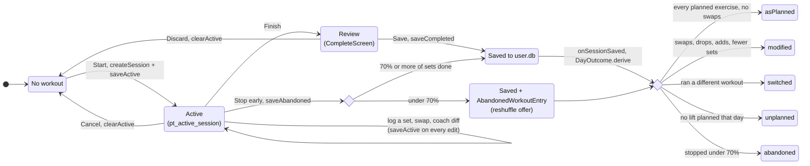
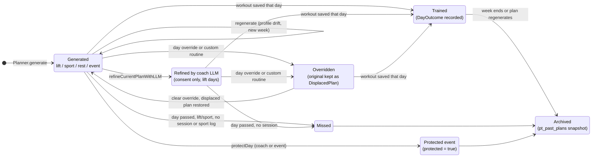
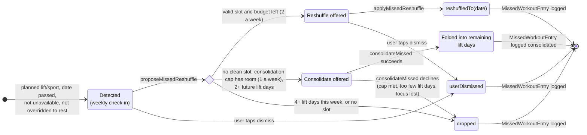

# State machines

Hand-written from the code, 2026-09-26. Each transition names the function that performs it, so a reader can check it. Re-verify after touching `SessionStore`, `DayOutcome`, `MissedWorkoutAutopilot` or `PlanStore+MissedWorkoutAutopilot`.

## A workout in progress

Source: `SessionStore.swift`, `TodayTab.swift`, `DayOutcome.derive`, `AbandonedWorkoutEntry.abandonmentThreshold` (0.70).

While a workout is Active, `PlanStore` skips automatic plan regeneration so the template cannot change under you.

## A planned day

Source: `Planner.generate`, `PlanStore+LLMRefinement`, `WeekOverrides.dayOverrides` / `displacedPlanByDate`, `PlanEdit.protectDay`, `PlanStore+History.snapshotCurrentPlan`.

## A missed workout

Source: `MissedWorkoutAutopilot.detect` / `proposeReshuffle`, `PlanStore+MissedWorkoutAutopilot`, `PlanStore.consolidateMissed`.

Reshuffle rules (`MissedWorkoutAutopilot`): drop at 4+ lift days, keep body-part coverage, never land the day after another hard day, skip protected, rest and event days, and respect the weekly budget. `dropped` and `userDismissed` leave the same plan; they are logged separately so the coach can tell "could not fit it" from "chose to skip". A successful consolidation logs `consolidated` (since 2026-09-26; it was logged `dropped` before, indistinguishable from a declined one). The banner lives only in the weekly check-in's missed step (`CheckInMissedScreen`) since build 122.
