# Manual swap review queue

Generated from `db/quality/swap_decisions.jsonl`. 15 borderline swap candidates that the auto-accept rules wouldn't touch. For each one:

- Look at the current image vs the candidate image.
- Edit `YES` or `NO` after `Replace with this candidate?`.
- After editing, run `scripts/quality/apply_manual_swaps.py` to land approved swaps.

## ex 453

Current (score 1): _Athlete holding resistance band but not performing face pull; no pulling motion or external rotation visible._  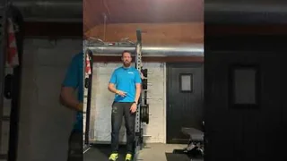

Candidate (free-exercise-db, license=MIT, score=4/med): _Cable pull visible with arm extension, but angle/rotation clarity unclear from this frame_  

- URL: `https://raw.githubusercontent.com/yuhonas/free-exercise-db/main/exercises/Face_Pull/0.jpg`
- Attribution: free-exercise-db (yuhonas), MIT

- Replace with this candidate? **NO**

---

## ex 659

Current (score 1): _Wide gym shot with athlete in background, no clear exercise demonstration visible_  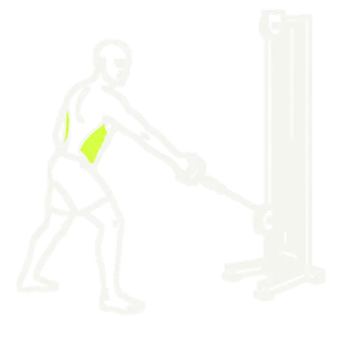

Candidate (wger, license=CC-BY-SA 4, score=4/med): _Cable row with unilateral stance visible, slight angle makes full form assessment difficult._  

- URL: `https://wger.de/media/exercise-images/1636/1bf3ee54-207c-4b53-b057-15adc1dd6128.png`
- Attribution: wger.de, CC-BY-SA 4 (author from API: Rottekongen)

- Replace with this candidate? **NO**

---

## ex 564

Current (score 1): _Image shows clay pigeon shooting, not a fitness exercise. No gym context or fitness movement present._  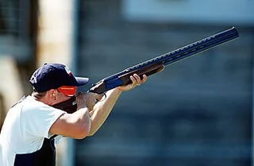

Candidate (free-exercise-db, license=MIT, score=3/med): _Plank-like core stability position visible, but unclear if this is specifically the shotgun mount drill or similar hold._  

- URL: `https://raw.githubusercontent.com/yuhonas/free-exercise-db/main/exercises/Shotgun_Row/0.jpg`
- Attribution: free-exercise-db (yuhonas), MIT

- Replace with this candidate? **NO**

---

## ex 851

Current (score 1): _Image shows children playing dodgeball, not a controlled exercise demonstration with medicine ball._  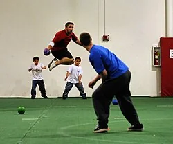

Candidate (free-exercise-db, license=MIT, score=3/med): _Athlete holds medicine ball in athletic stance but unclear if mid-catch/throw or posed. Ambiguous timing._  

- URL: `https://raw.githubusercontent.com/yuhonas/free-exercise-db/main/exercises/Catch_and_Overhead_Throw/0.jpg`
- Attribution: free-exercise-db (yuhonas), MIT

- Replace with this candidate? **NO**

---

## ex 889

Current (score 1): _Host face/talking head shot. No exercise demonstration visible. Text overlay dominates._  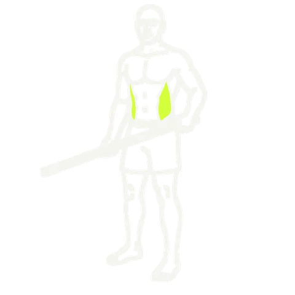

Candidate (free-exercise-db, license=MIT, score=3/med): _Athlete in rotational stance with implement, but unclear if this is specifically shotgun mount rotation drill versus similar rotational exercise_  

- URL: `https://raw.githubusercontent.com/yuhonas/free-exercise-db/main/exercises/Shotgun_Row/0.jpg`
- Attribution: free-exercise-db (yuhonas), MIT

- Replace with this candidate? **NO**

---

## ex 73

Current (score 3): _Shows a lunge-like stretch position, but unclear if this is the complete World's Greatest Stretch sequence._  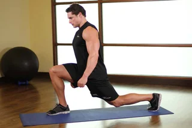

Candidate (free-exercise-db, license=MIT, score=4/med): _Plank position with leg positioning visible, likely mid-World's Greatest Stretch sequence_  

- URL: `https://raw.githubusercontent.com/yuhonas/free-exercise-db/main/exercises/Cat_Stretch/0.jpg`
- Attribution: free-exercise-db (yuhonas), MIT

- Replace with this candidate? **NO**

---

## ex 484

Current (score 2): _Dumbbell squat shown, not a weighted carve squat. Similar lower body exercise but wrong movement pattern._  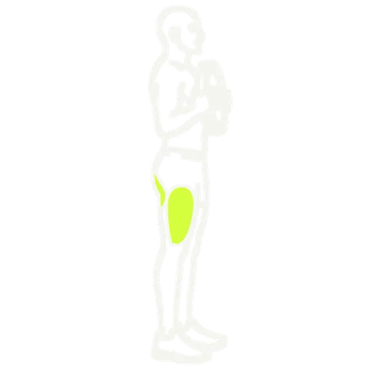

Candidate (free-exercise-db, license=MIT, score=3/med): _Athlete in squat position with dumbbells, but unclear if performing weighted carve squat or standard dumbbell squat._  

- URL: `https://raw.githubusercontent.com/yuhonas/free-exercise-db/main/exercises/Weighted_Jump_Squat/1.jpg`
- Attribution: free-exercise-db (yuhonas), MIT

- Replace with this candidate? **NO**

---

## ex 915

Current (score 2): _Athlete in squat rack with dumbbells, not performing barbell snatch. Related but wrong exercise._  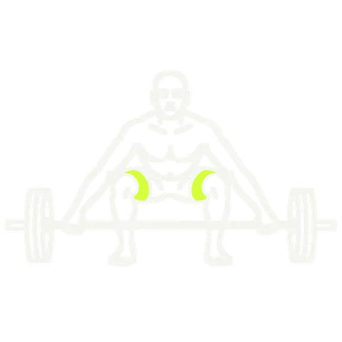

Candidate (wikimedia, license=CC-BY-SA-3.0, score=3/med): _Line drawing shows barbell lift posture, but anatomical sketch lacks detail to confirm snatch versus clean or other Olympic lift._  

- URL: `https://upload.wikimedia.org/wikipedia/commons/thumb/7/7f/One-arm-snatch-1.gif/320px-One-arm-snatch-1.gif`
- Attribution: Wikimedia Commons, CC BY-SA 3.0, author: Everkinetic

- Replace with this candidate? **NO**

---

## ex 7

Current (score 4): _Ab wheel rollout clearly shown mid-motion, but text overlay obscures upper body slightly._  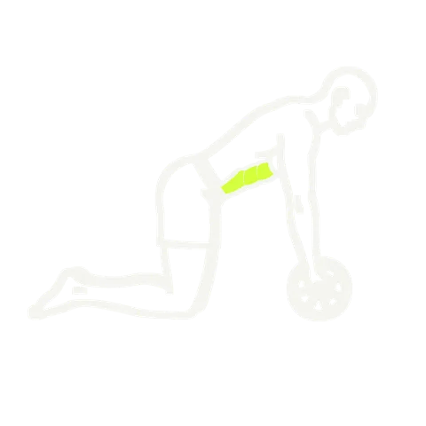

Candidate (free-exercise-db, license=MIT, score=4/high): _Plank position on bench, not ab wheel rollout. Related core exercise but wrong equipment/variation._  

- URL: `https://raw.githubusercontent.com/yuhonas/free-exercise-db/main/exercises/Barbell_Ab_Rollout/1.jpg`
- Attribution: free-exercise-db (yuhonas), MIT

- Replace with this candidate? **NO**

---

## ex 120

Current (score 5): _Clear bear crawl position mid-motion on track, proper form with hands and feet elevated, core engaged._  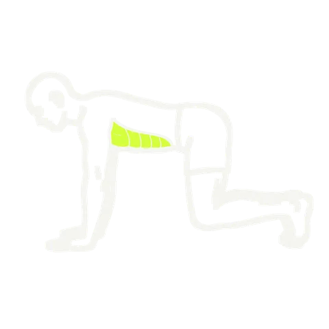

Candidate (free-exercise-db, license=MIT, score=5/high): _Clear bear crawl position mid-motion: hands and feet planted, hips elevated, neutral spine, bodyweight only._  

- URL: `https://raw.githubusercontent.com/yuhonas/free-exercise-db/main/exercises/Bear_Crawl_Sled_Drags/1.jpg`
- Attribution: free-exercise-db (yuhonas), MIT

- Replace with this candidate? **NO**

---

## ex 420

Current (score 5): _Athlete clearly demonstrates reverse Nordic curl mid-motion, quadriceps engaged, proper form visible._  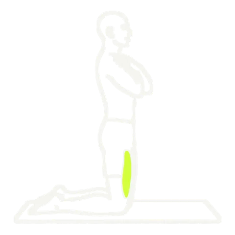

Candidate (wger, license=CC-BY-SA 4, score=5/high): _Clear anatomical diagram showing reverse Nordic curl progression with proper form and positioning._  

- URL: `https://wger.de/media/exercise-images/909/159222d9-c1e4-46ae-89ee-6a2dfaab978d.png`
- Attribution: wger.de, CC-BY-SA 4 (author from API: karly)

- Replace with this candidate? **NO**

---

## ex 422

Current (score 4): _Athlete performing lateral deceleration drill with cones visible, but text overlay partially obscures view_  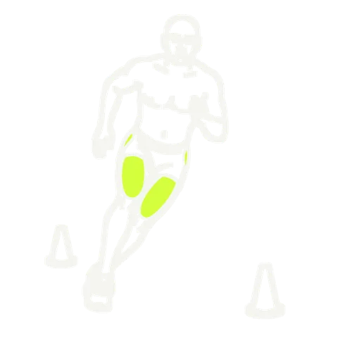

Candidate (free-exercise-db, license=MIT, score=4/med): _Athlete demonstrates lateral deceleration with hand contact, likely stopping drill. Minor: unclear if cone placement is optimal._  

- URL: `https://raw.githubusercontent.com/yuhonas/free-exercise-db/main/exercises/Linear_Acceleration_Wall_Drill/0.jpg`
- Attribution: free-exercise-db (yuhonas), MIT

- Replace with this candidate? **NO**

---

## ex 601

Current (score 3): _Single-leg squat position visible but unclear if skater squat specifically; arm position and leg extension ambiguous._  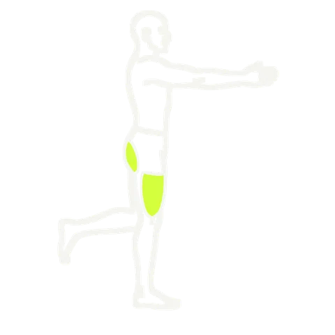

Candidate (free-exercise-db, license=MIT, score=3/med): _Athlete using suspension trainer in single-leg stance, but depth and form ambiguous from this angle._  

- URL: `https://raw.githubusercontent.com/yuhonas/free-exercise-db/main/exercises/Single-Leg_High_Box_Squat/0.jpg`
- Attribution: free-exercise-db (yuhonas), MIT

- Replace with this candidate? **NO**

---

## ex 936

Current (score 5): _Clear mid-motion hip abduction machine exercise, proper form visible, gym setting evident_  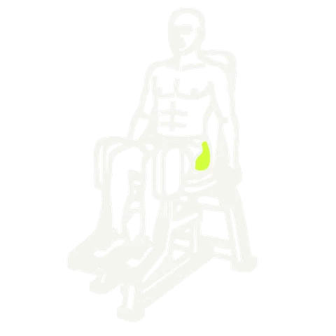

Candidate (wger, license=CC-BY-SA 4, score=5/high): _Clear mid-motion hip abduction on machine, proper form, legs spread apart against resistance._  

- URL: `https://wger.de/media/exercise-images/1748/923a3ff7-c269-49bd-9f03-697151a40f06.jpg`
- Attribution: wger.de, CC-BY-SA 4 (author from API: Tierrasverdes)

- Replace with this candidate? **NO**

---

## ex 971

Current (score 4): _Bicycle crunch demonstrated clearly, but large text overlay obstructs view slightly._  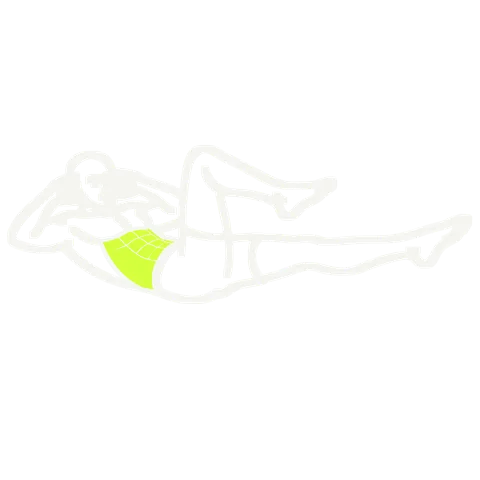

Candidate (free-exercise-db, license=MIT, score=4/high): _Clearly bicycle crunch position, slight angle awkwardness and gym background clutter minor issues_  

- URL: `https://raw.githubusercontent.com/yuhonas/free-exercise-db/main/exercises/Cable_Crunch/0.jpg`
- Attribution: free-exercise-db (yuhonas), MIT

- Replace with this candidate? **NO**

---
